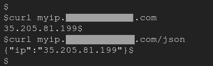

# My-ip

Simple kubernetes deployment to simulate `ifconfig.co`,`ifconfig.me` or similar.

## Prerequisites

- K8s cluster
- Ingress controller(nginx or similar)

## Installation

`kubectl apply -f https://raw.githubusercontent.com/brokenpip3/my-ip/master/my-ip.yaml`

Change the ingress `host` fqdn according to your needs

`kubectl apply -f https://raw.githubusercontent.com/brokenpip3/my-ip/master/ingress.yaml`

## Usage

- Public ip: `curl myip.your.fqdn`

- Same but in json: `curl myip.your.fqnd/json`

## Credits 

- https://www.ecalamia.com/blog/show-ip-api-nginx/
